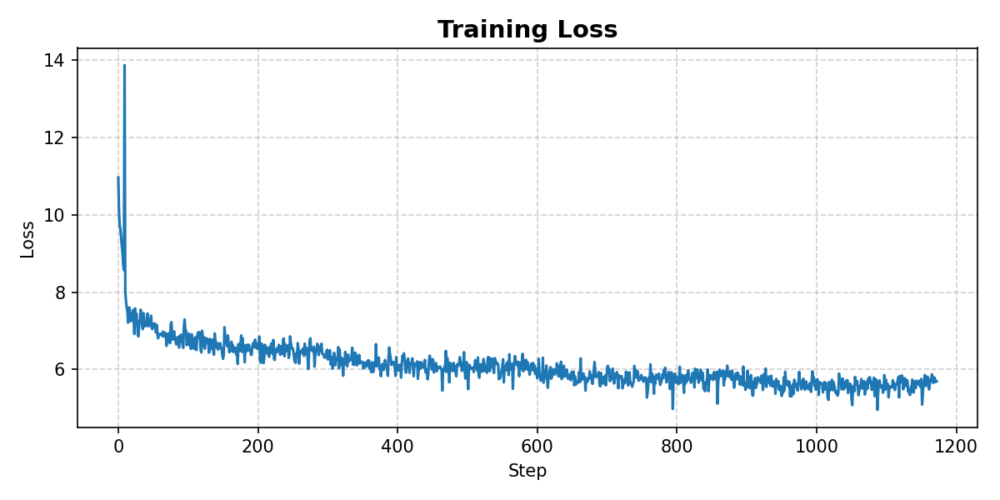
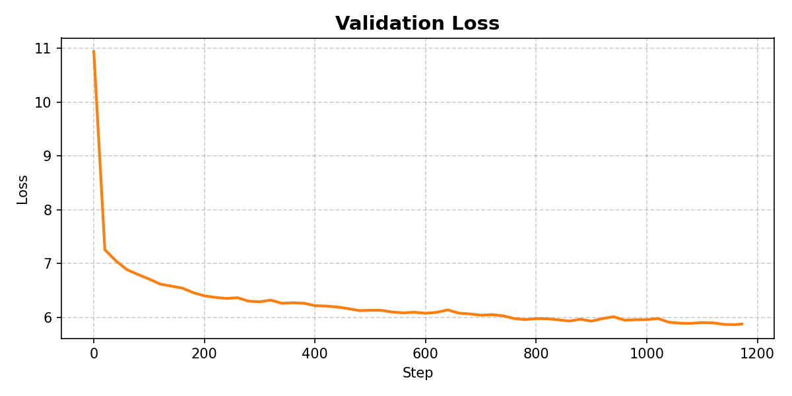

# GPT-2 Reproduction from scratch

A from-scratch reproduction of a GPT-2 style decoder-only transformer in PyTorch. The model was built by training on 
1. Tiny Shakespeare dataset - ~330K Tokens
2. WikiWeb2M - ~2 million token wikipedia based dataset

## Overview
This is a hands on implementation of GPT-2 style language model using pytorch. I built this project to understand the GPT-style autoregressive transformers beyond high-level APIs. 
Some of the main ideas I wanted to understand more deeply were:

- how text is tokenized with BPE
- how causal self-attention is implemented
- how token and positional embeddings work together
- how decoder only transformers are assembled end to end
- how training can be optimized for faster execution and better hardware utilization

The GPT-2 paper, Language Models are Unsupervised Multitask Learners, was a major reference for this implementation. I tried to replicate the hyperparamter settings as much as possible and what my GPU allowed me to. 

The project currently contains separate scripts for model definition, training, and sampling:

- `gpt2_model.py` — model architecture
- `train.py` — training loop
- `output_generation.py` — text generation / inference

## Implemented Components

This project includes the following core components:

- BPE tokenization
- token embeddings
- positional embeddings
- multi-head causal self-attention
- feed-forward MLP block
- residual connections
- layer normalization
- autoregressive next-token prediction
- training loop in PyTorch
- validation loss estimation
- text generation from a trained model

## Training Configuration

- number of layers = 12
- number of heads  = 12
- embedding dimension = 768
- vocab_size = 50304
- context length = 512
- batch size = 4
- optimizer = Fused AdamW
- learning rate schedule = cosine decay (`max_lr = 6e-4`, `min_lr = 6e-5`)
- total training steps = 1173 (1 epoch)
- gradient accumulation steps = 4 
- effective batch size = 8192 tokens/update
- hardware used = T4 GPU
- validation steps = 20
- vvalidation interval = every 20 training steps

## Repository Structure

```text
gpt2/
├── assets/
│   ├── train_loss.png
│   └── val_loss.png
├── gpt2_model.py
├── train.py
├── output_generation.py
├── README.md
├── requirements.txt
└── .gitignore
``` 

## Tech Stack

- Python
- PyTorch
- NumPy
- tiktoken

## How to Run
1. Clone the repository
    - git clone https://github.com/Rahul-Narasimhan/gpt2.git
    - cd gpt2

2. Install dependencies
pip install -r requirements.txt

3. Train the model
python train.py

4. Generate text samples
python output_generation.py

## Training Setup

This model is being trained on a small Wikipedia-based dataset of roughly 2 million tokens.
However, the training can be done on any dataset. The script takes care of tokenizing (BPE tokenization). 
The user only needs to point the script to the correct training and validation .txt file to start the training process.
Unfortunately, currently, only .txt is supported. 

### Current setup includes:

decoder-only transformer
next-token prediction objective
train/validation split
validation loss tracking during training
generation using the trained model

## How I Built this

I approached this project incrementally. 
1. I first built a decoder-only transformer from scratch using the Tiny Shakespeare dataset.

2. I implemented the core building blocks step by step:

    - BPE tokenization
    - token embeddings
    - positional embeddings
    - attention mechanism
    - residual skip connections
    - layer normalization
    - feed-forward MLP blocks

3. After each component was added, I tested the implementation before moving to the next piece.

4. Once the base transformer was working, I began implementing and testing several GPT-2 style optimizations and logged the experimental results.

5. After completing those experiments on Tiny Shakespeare, I switched to the ~2M token corpus and trained the model further to study training behavior on a larger dataset.

## Performance Experiments
I ran a series of controlled experiments to measure how architecture and implementation changes affected training throughput. The table below reports approximate mean step time and throughput observed from experiment logs. I logged these experiments incrementally as I modified the model and training pipeline. 

To understand the runtime impact of different implementation choices, I compared several model and training configurations on CPU and Google Colab T4 GPU. The goal was to track how changes such as weight tying, initialization, `torch.compile`, Flash Attention, and optimizer configuration affected step time and token throughput.

All The experiments below was performed on the tiny shakespeare dataset with a batch_size = 4, sequence_length = 32. I understand that this is very naive and is not a rigorous or a proper experimentation setup, but the idea was to just understand the core concepts.

 | Experiment | Device | Mean step time (ms) | Mean tokens/sec | Notes |
|---|---:|---:|---:|---|
| Baseline GPT-2 (no weight tying, no GPT-2 init tweaks) | CPU | 2100 | 61 | Initial reference run |
| GPT-2-style weight initialization | CPU | 1962 | 65 | Small CPU improvement |
| Weight tying + GPT-2-style initialization | CPU | 1747 | 74 | Best CPU throughput among tested setups |
| Baseline GPT-2 (no weight tying, no GPT-2 init tweaks) | T4 GPU | 84 | 1483 | Baseline GPU run |
| Weight tying + GPT-2-style initialization | T4 GPU | 74 | 1694 | Clear improvement over baseline |
| + `torch.compile` | T4 GPU | 74 | 1687 | Similar mean throughput; first-step compile overhead distorts average |
| + Flash Attention | T4 GPU | 70 | 1773 | Noticeable speedup |
| + Vocab size padded to 50304 | T4 GPU | 69 | 1777 | Small additional improvement |
| + Weight decay, fused AdamW, cosine LR schedule | T4 GPU | 66 | 1914 | Best mean throughput in these experiments |

### Results

After training the model for 1 epoch, with 1173 steps, here are the train and val loss curves

### Train Loss


### Validation Loss


Some observations from the plots.
  - Train loss is noisy and high in the beginning, which is expected as the model moves from initialisation to learning phase
  - Train loss starts at around ~11 , which is expected because -ln(1/vocab_size) = -ln(1/50304) = 10.82
  - Train and Val loss remain fairly close, there is on obvious signs of overfitting

## Inference Result
The model produced the below text as inference output after 1 epoch of training. Clearly, it is not trained enough to produce proper text, but atleast there is a bit of english looking text and flow here and there, so some learning has happened.

  - max_new_tokens=150,
  - temperature=1.2,
  - top_k=50,

/////////////////
The history of science @-@ century , as the player . At the first song . The song was a " The song was a " The song was " The song , who was " . " , " , with " " It was " , as " " 

 According to a song " The " . During the song . " 's first album " and " It 's lyrics " , a " , " The show . " I ' " and " A song " . This song " I ] , " ... was a song was " . 

 " The song , I 's " was her " was a song was " The song 's " . He 's album " It " and " was " The episode , " , " " I 't 's 's " I 't do the song I 's " , " The " " a best on the album 's a
/////////////////

## What I Learned

Through this project, some of the foundational things i have gained a deeper understanding of are
  - how token and positional embeddings interact
  - how causal self-attention works
  - why residual connections and layer normalization matter
  - how logits are produced for next-token prediction
  - how training and validation loops are structured
  - how sampling works at inference time
  - how to move from conceptual understanding to working PyTorch implementation

## Next Steps

  - Improve logging and experiment tracking
  - Train on a larger dataset and understand better how hyperparamters interact with each other, not only about hyperparameters at  the surface level like vocab_size, batch, but also hyperparamters of AdamW and so on.
  - Compare outputs across different training runs
  - Improve generation quality and sampling controls

